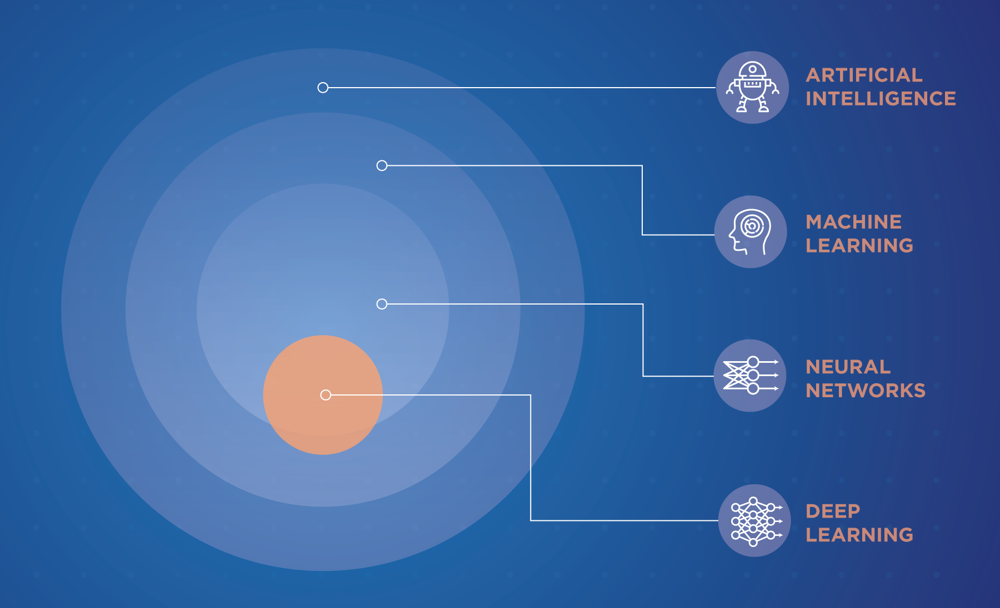
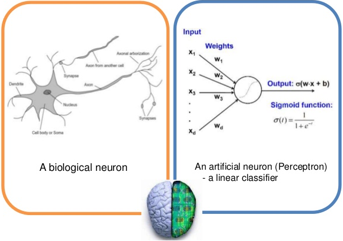

# 딥러닝 기초(Deep Learing - Basic)

인공지능은 1950년대 초기 컴퓨터 과학 분야의 일부 선각자들이 "컴퓨터가 생각할 수 있는가?" 라는 질문을 하면서 시작되었다. 인공지능은 머신러닝과 딥러닝을 포괄하는 분야이다
인공지능 기술 중 프로그래미들이 명시적인 규칙을 충분하게 많이 만들어 지식을 다루면 인간 수준의 인공지능을 만들 수 있다는 실볼릭 AI(Symbolic AI) 접근법이 제안되었으며
이는 1950년대 부타 1980년대 까지 지벼적인 패러다임이었다. 1980년데 전문가 시스템(Expert System)의 등장으로 인기가 절정에 이르렀다. 
그리나 이미지 분류, 음성인식, 언어 번역과 같은 복잡하고 불분명한 문제를 해결할 수 있는 규칙을 명확하게 찾는 것은 매우 어려운 일이다. 이러한 심볼리 AI를 대치하기 위한 방법으로 머신 러닝이 등장하였다.

<인공지능-머신러닝-뉴럴네트워크-딥러닝의 관계>

딥러닝은 신경망의 한 종류이고 신경망은 머신러닝의 한 가지 방법, 머신러닝은 인공지능을 실현하는데 필요한 기술이다.  
기존의 머신러닝 방식으로 처리가 어려운 문제를 딥러닝으로 해결하려는 시도가 많아지고 있다. 

**신경망**
인간의 뇌의 신경세포(뉴런)로 구성된 신경세포망을 모방해 컴퓨터에서 구현한 신경세포망

**딥러닝**
딥러닝은 계층이 여러 개인 신경망을 말한다. 게층을 깊게 한 것을 DNN(Deep Neural Network)이라 부르고 이것을 딥러닝이라고 한다.
충분한 성능을 발휘하는 DNN의 계층은 4계층 이상 이다.  

**사람의 학습 능력을 모방하기 위해 다양한 컴퓨터 알고리즘과 방법론을 연구하는 분야** 

**신경망(인공 신경망) 알고리즘을 주로 사용하는 머신 러닝의 한 분야 - 뇌의 신경세포의 구조에서 착안해서 고안된 알고리즘 **

* 우리의 뇌
비교적 단순한 정보를 처리하는 많은 신경세포들로 이루어짐. 
하나의 신경세포는 다른 신경세포로 부터 정보를 받아 새로운 정보를 생성하고 다른 신경세포로 전달 
1957년 프랭크 로전블렛이 개발한 퍼셉트론 알고리즘이 딥러닝과 많은 머신 러닝 알고리즘의 기초가 됨

## 딥 러닝 알고리즘과 신경망 구조
퍼셉트론(Perceptron): 하나의 신경세포를 인공적으로 모델링한 뉴런 

(출처: https://www.slideshare.net/jbhuang/lecture-29-convolutional-neural-networks-computer-vision-spring2015)

퍼셉트론은 1957년 프랑크 로젠블라드(Frank Rosenblatt)에 의해 처음 고안된 오래된 알고리즘이다. 앞의 왼쪽 그림은 생물학적인 뉴런(neuron)을 나타내고 있다. 
오른쪽의 그림은 인공 뉴런이 퍼셉트론으로 다수의 입력을 받아 하나의 출력을 만든다. 이 퍼셉트론에서 가중치(weight)가 각각의 입력신호에 부여되어 신호의 총합이 정해진 임계값(\theta,세타)을 넘었을 때 1을 출력한다. 이는 뉴런의 활성화(activation)라고 표현한다. 활성화되면 1의 값을 가지고 활성화되지 않으면 0의 값을 가진다. 퍼셉트론의 출력 값이 1 또는 0이기 때문에 선형 분류(linear classifier) 모형이라고 한다. 

기본 알고리즘
뉴런의 입력: X1, X2
각 입력 값에 각각 가중치: W1, W2 
결과 값: Y = X1 * W1 * X2 * W2

마빈 민스키(Marvin Minsky) 등이 단순한 퍼셉트론으로는 배타적 논리합(XOR) 문제를 풀 수 없다고 증명하였고 다층퍼셉트론으로는 XOR 연산이 가능함을 보였다. 

* 신경세포 하나가 처리하는 정보는 단순하나 수턴 억에서 1조 개에 달하는 1조 개에 달하는 많은 수의 신경세포가 거미줄처럼 앍혀 있어 복잡한 정보를 가공할 수 있음
* 선경세포들은 여러 개의 층을 이루어 역할을 담당

신경먕: 여러 개의 뉴런이 하나의 계층을 하니의 계층을 형성하고 이런 계층을 다사 여러 개 쌓어 올림 (기본적인 신경명은 입력층, 중간층, 출력층의 3층 구조 네트워크)

## 딥러닝의 역사

### 1차 인공지능 부흥기 (1950 ~ 1970년대)

손으로 수행했던 작업과 계산을 자동으로 실행하는 규칙을 컴퓨터에 입력하기 위해 주로 규칙 기반(rule-based) 인공지능이 연구되었고 
오토마톤(automaton)과 새로운 프로그래밍 언어가 많이 개발되었다. 

* 규칙기반: "A이면 B"라는 규칙을 기초로 한 알고리즘을 개발하여 컴퓨터에서 프로그램으로 구현하는 것 
* 오토마톤: 

## 2차 인공지능 부흥기 (1980년대)

많은 데이터를 축적할 수 있는 데이터베이스가 개발되면서 목적하는 정보를 고속으로 탐색하는 정보 검색, 데이터 마이닝 등이 연구 개발되었다. 
컴퓨터 체스, 오셀로 등 일부 보드 게임에서 컴퓨터 실력이 사람을 능가하게 되었다. 인공지능 분야에서 데이터베이스를 활용한 지식기반 알고리즘의 연구가 활발해지면서 **전문가 시스템**이라 부르는 시스템이 등장하였따. 

신경망 분야에서도 1967년 아마리 슌이치가 소개한 오차 역전파법(back-propagation)이 1986년 데이비드 럼멜하트(David E. Rumelhart), 제프리 힌튼(Geoffrey Hinton), 로널드 웰리엄스(Ronald Willams) 등에 의해 유효성을 보이고 단순한 퍼셉트론으로  수 없었던 배타적 논리합 문제를 해결할 수 있음을 알게되었따. 그러나 층을 쌓으면 쌓을수록 성능이 떨어지는 **경사소실 문제**와 **지역 최소화 문제** 들 때문에 발전되지 않았다.

## 3차 인공지능 부흥기 (1990년대)

컴퓨터 성능 향상과 함께 제프리 힌트의 연구로 4 층 이상의 심층 신경망에서 지역 최적해와 경사소실 문제를 해소할 수 있었다. 2012년 ILSVRC(ImageNet Large Scale Visual Recognition Challenge)에서 제프리 힌튼이 DNN을 이용하여 이미지 성공률이 다른 팀의 성능보다 월등하게 높은 **딥러닝**이 주목받게 되었다. 오토인코더를 이용한 이미지 자동 생성, 자연어 생성, 자동 번역, 로봇 제어 등 여러 분야에 이용되면서 인공지능의 부흥기를 맞고 있다. 

* 모델 학습 또는 훈련 과정 
준비된 표본 데이터를 입력받아 원하는 출력 데이터가 만들어지도록 연결된 뉴런끼리 얼마만큼 정보를 주고받을지 가중치를 매번 조정하여 신경망에 있는 모든 뉴런 간의 연결을 최적화

* 추론 과정
모델 학습이 완료되면 샘플 데이터가 아닌 실제 상황의 데이터를 넣어 결과를 얻어내는 것 

* 심층 신경망 (DNN: Deep Neural Network)

  * 입력 계층(Input Layer): 데이터를 입력받는 계층
  
  * 출력 계층(Output Layer): 결과값을 만들어내는 계층 
  
  * 중간 계층, 은닉 계층(Hidden Layer): 입력 계층과 출력 계층 사이의 하나 이상의 게층 
  

## 딥 러닝 응용 분야

* 이미지 안에서 물체를 인식하거나 이미지의 내용을 요약하는 분야 
* 언어를 번약하고 음성을 인식하는 분야
* 자동차 자율주행 자동차 개발 및 예술 분야 

* CNN(Convolution Neural Network)
이미지 안의 물체를 인식하거나 이미지의 장면을 글로 요약하는데 사용하는 구조 
스탠포트 대학의 비전 랩에서 2015년 말 이미지의 장면을 자시히 글로 요약해주는 덴스갭(DenseGap) 을 개발하여 공개
구글 2015년 7월 딥드림(DeepDream) 이라는 CNN 구조 발표: 서로 다른 이미지 패턴을 인식하고 합성한느 방식으로 몽환적인 이미지를 만듬
페이스북은 CNN과 RNN을 조합하여 텍스트 분석 엔진인 딥텍스트(DeepText)를 발표 

* RNN
번역이나 음성인식 분야에 주로 사용
구글의 Magenta 프로젝트는 RNN을 이용하여 음악을 작곡하는 시도를 하고 있음

* 딜 러닝 연구에 사용되는 라이브러리

  * 텐서플로우(Tensorflow)
  
* 딥 러닝의 석학들
  * 앤드루 응(Andrew Ng): 텐서플로우를 만든 구글 브레인팀을 이끌었고 바이두에 합류 
  * 얀 르쿤(Yann LeCun):  
  * 제프이 힌튼(Geoffey Hinton)
  

## References
1. https://sacko.tistory.com/10
2. 허민석, 나의 첫 머신러닝/딥러닝 - 위키북스
3. 히로키 타니오카 & 코우신, 가장 쉬원 딥러닝 입문 교실 - 위키북스 
4. 

