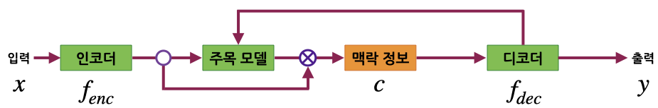
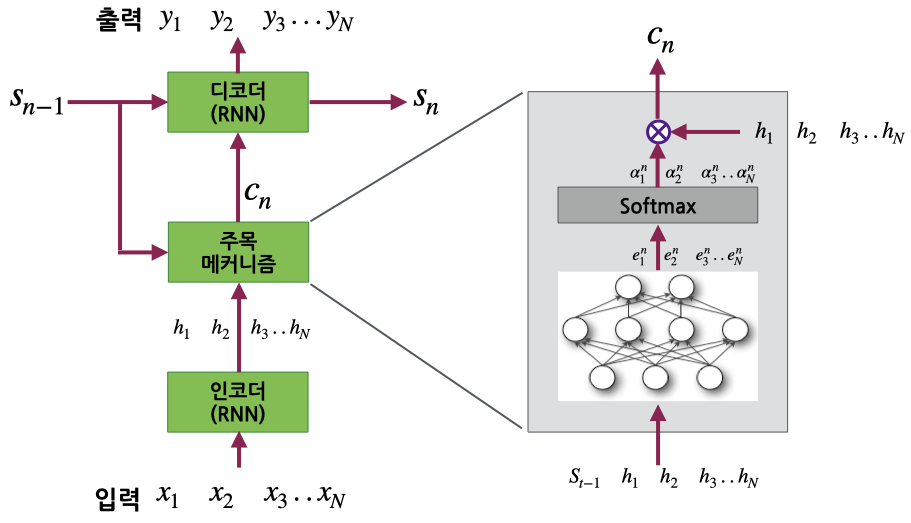

# 종단간 학습 모델(end-to-end learning)

종단간 학습: 입력과 출력 정보로 구성된 학습 데이터를 거의 원보 그대로 사용하여 개발자의 중간 개입없이 입력으로 부터 기대하는 출력을 만들어 내는 학습 

* 종단간 학습을 하는 딥러닝 구조인 인코더-디코더 구조 
* 어텐션(attention) 메커니즘을 통해 입력의 특정 영역에 선택적인 주목(selective attention)을 할 수 있는 인코더-디코더 구조

## 인코더-디코더 네트워크

인코더-디코더 네트워크는 입력 데이터의 구조와 출력 데이터의 구조 간의 대응 관계를 찾는 문제를 다루는 딥러닝 신경망 구조이다.
인코더-디코더 네트워크는 구조적인 정보가 포함된 입력을 일정한 차원의 특징 벡터로 압축하여 표현하는 인코더(encoder)와 특징 벡터를 출력 공간의 데이터로 변환하는 디코더(decoder)로 구성된다. 

* 인코더가 사진 또는 동영상에 대한 맥락정보(컨텍스트 벡터: Context Vector)를 추출하면 디코더가 이를 설명하는 문장을 생성하는 구조

  - 사진을 설명하는 문장을 만들어 내는 **영상 주석 달기(image captioning)**
  - 동영상을 설명하는 문장을 만들어 내는 **동영상 묘사하기(video description)**

* 인코더가 주어진 문장에 대한 맥락정보를 추출하면 디코더가 문장의 의미를 표현하는 영상을 생성하는 구조

  - 문장으로 부터 영상을 만들어 내는 **영상 합성(image synthesis)**

* 인코더가 주어진 시퀀스에 대한 맥락정보를 추출하면 디코더는 맥락정보로 부터 다른 종류의 시퀀스를 생성하는 seq2seq 구조

   - 특정 언어의 문장을 다른 언어의 문장으로 변환하는 **기계 번역(machine translation)**
   - 음성을 문장으로 바꿔주는 **음성 인식(speech recognition)**

인코더-디코더 네트워크 구조의 맥락정보는 입력과 출력보다 훨씬 저차원인 실수 벡터로 표현된다.

## 인코더-디코더 네트워크 예 

* 일반적인 구성

인코더 는 입력 데이터 **x**를 읽어들여 일정한 차원의
실수 벡터 **c**를 생성한다. 인코더가 만들어내 벡터 **c**는 입 데이터를 요약한 맥락 정보이다. 

인코더 는 입력의 형태에 따라 다른 방식으로 구현된다. 
입력 **x**가 문장이면 재귀 신경망(RNN) 종류, 영상이라면 컨볼루션 신경망(CNN) 등이 사용될 수 있다.

디코더 는 입력에 대한 맥락정보 **c**를 사용하여 출력 **y**를 생성한다. 디코더는 입력 **x**에 대한 출력 **y**의 조건부 확률을 계산하는 것과 같다.

디코더 는 출력 형태에 따라 다른 방식으로 구현될 수 있다. 출력 **y**가 문장이면 재귀 신경망(RNN) 종류, 영상이면 제한 볼츠만 머신 등이 사용될 수 있다.

## 인코더-디코더 네트워크의 문제점

인코더-디코더 네트워크의 맥락정보는 입력의 크기에 관계없이 일정한 크기의 수치 벡터로 표현한다. 엽력의 크기가 커지면 많은 정보를 포함하게 되는데 이들 정보를 모두 일정한 크기의 벡터로 표현하는 것은 어렵다. 즉 인코더-디코더 네트워크에서 입력 시퀀스가 큰 경우 좋은 성능을 얻지 못하는 추세가 있다. 

## 어텐션 메커니즘 

재귀 신경망은 과거의 정보를 모두 통합하는 역할을 하나 과거의 내용일수록 점차 망각할 수 있다. 따라서 재귀 신경망으로 인코더를 구현할 경우 입력의 길이가 길어지면 일정한 크기의 벡터로는 입력의 모든 정보를 표현하기 어려워진다. 
재귀 신경망의 은닉층 노드 개수를 증가시키거나 각 과거 시점의 은닉층 상태 정보를 디코더에서 함께 사용하도록 하는 것을 고려할 수 있다.
디코더는 특정 시점의 출력을 결정할 때 인코더의 모든 시점에 대한 은닉층 상태 정보를 필요로 하지 않는다.
예로 한국어 문장을 영어 문장으로 번역하는 경우 한국어 문장의 각 단어는 영어 문장의 모든 단어가 아닌 일부 단어와 대응된다. 그러므로 디코더는 인코더의 모든 시점의 은닉층 상태 모두가 아닌 일부에 주목하여야 한다. 

* 주목 메커니즘: 인코더-디코더 네트워크에서 디코더는 인코더가 만들어내는 정보의 특정 부분에 주목하여 효과적으로 출력을 만들어 내기도 한다. 인코더의 시각적, 공간적 또는 시공간적인 상태들을 결합하여 주목해야 할 부분에 대한 맥락 정보를 만드는 역할을 하는 구성요소 

주목 메커니즘을 사용하는 인코더-디코더 네트워크에서는 인코더가 입력 전체에 대한 하나의 맥락 정보를 만들어 디코더에 전달하는 대신 디코더가 출력을 산출하는 매 시점마다 맥락정보를 계산하여 사용한다. **맥락정보는 해당 시점의 출력을 결정할 때 주목해야하는 입력의 정보와 직전 시점까지의 디코더의 상태를 바탕으로 계산한다.**

다음 그림은 기계 번역과 같이 시퀀스-투-시퀀스 변환을 하는 주목 메커니즘을 포함하고 있는 인코더-디코더 네트워크 구조의 예이다. 
입력 시퀀스 에 대해서 인코더는 
재귀 신경망(RNN) 또는 양방향 재귀 신경망 등을 사용하여 특정 벡터의 시퀀스  를 생성한다.
인코더-디코더 망에서 마지막 시점의 출력  만이 맥락정보 
로 디코더에 전달된다. 
주목 메커니즘을 사용하면 매 시점  별로 해당 시점에 주목해야할 요소를 고려하여 만들어진 맥락정보 가 만들어져 디코더에 전달된다. 

주목 메커니즘은 인코더의 각 단계별 출력 와 시점 
의 의 중요도를 나타내는 를 가중합을 하여 시점 의 디코더에 대한 맥락 정보 
을 계산한다.

앞의 그림의 주목 메커니즘은 시점 의 인코더 상태인
의 중요도 
을 다층 퍼셉트론(Multi-Layer Perceptron)과 소프트맥스를 사용하여 도출한다. 
다중 퍼셉트론은 소프트맥스를 적용할 값  를 결정한다. 
여기에서 

