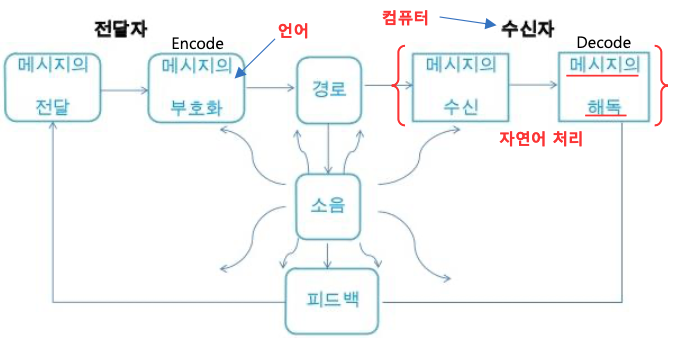

# NLP(Natural Language Processing) and AI - 자연어 처리와 인공지능

## 자연어 처리

자연어 처리는 우리가 일상 생활에서 사용하는 언어(자연어: natural language)를 컴퓨터가 해독하고 의미를 분석하여 이해하고 활용하는 기술이다.

* 자연 언어: 특정 집단이 모국어로 사용하는 자연발생적인 언어
* 인공 언어: 형식 언어, 프로그래밍 언어와 같이 특정 목적을 위해 인위적으로 만들어진 언어 

<출처: 김성현 - 딥러닝 기반 자연어 언어모델 BERT 발표자료>

즉 자연어 처리는 생각 또는 느낌 등을 표현할 수 있는 음성 또는 문자 등의 언어를 컴퓨터의 자연어 처리 기능에서 입력받아 음성 또는 문자를 해독하고 의미를 분석하는 것이다. 

## 자연어 처리 방법

자연어 처리 방법은 규칙/지식 기반 접근법(Symbolic approach)와 확률/통계 기반 접근법(Statistical approach)으로 구분된다.

* 확률/통계 기반 접근법
	- TF-IDF(Term Frequency-Inverse Document Frequency)를 이용한 키워드 추출 방법
		+ TF: 단어가 문서에 등장한 개수 (일반적으로 TF가 높을수록 중요한 단어라 판단하나 관사, 정관사 등 중요도가 낮은 단어가 존재함)
		+ DF: 해당 단어가 등장한 문서의 개수 (DF가 높을 수로 중요하지 않은 단어로 판단함) - term x withing document y
		
        - ) 

## 자연어 처리 단계 

자연어 처리는 기본적으로 문장을 분석하여 문장을 이해하고 이를 바탕으로 전체 내용을 파악하려는 작업으로 다음과 같은 단계로 이루어 진다. 

* 전처리(Pre-processing)
	- 개행문자, 특수문자, 공백, 불용어, 조사, 이메일 링크 제거, 중복 표현 제어, 띄어쓰기, 문장분리 보정 등이 이루어 진다.   
* 토큰화(Tokenizing)
	- 토큰화 방법에는 어절 토큰화, 형태소 토큰화, n-gram 토큰화, WordPiece 토큰화 등이 있다. 
* 어휘 분석(Lexical analysis)
	- 형태소 분석(morphological analysis): 입력된 문자열을 분석하여 형태소 단위로 분해하는 과정
	- 개체명 인식
	- 상호 참조
* 구문 분석(sytantic analysis)
	- 문장이나 구절을 만드는 규칙인 구문에 따라 문장이 가지는 구문 구조를 분석하여 문장을 구성하는 문자열들이 문장에서 어떤 역할을 하는지 결정하는 과정 
	- "나는 책을 읽는다"라는 문장에서 "나는"은 주어로, "책을"은 목적어로, "읽는다"는 서술어로 분석
	- 구문 분석 결과는 보통 트리 형태로 표현 - 문장을 구문 분석하여 파스 트리(parse tree)를 만들어 내는 작업(파싱: parsing)이 요구됨
* 의미 분석(segmantic analysys)
	- 구문 분석의 결과를 해석하여 문장의 의미를 결정하는 과정 
	- 직설적인 문장은 형태소의 의미를 결합하여 의미를 유추할 수 있으나 은유나 직유와 같은 비유법을 사용한 문장의 의미를 유추하기 위해서는 배경지식이 필요
* 화용 분석(prgramatic analysis)
	- 실제 상황적 맥락 (말하는 이와 듣는 이의 관계, 시간과 장소, 주제를 고려하여 문장이 실세계와 가지는 연관 관계)을 분석하여 대화의 의도를 파악하는 과정
	
## 참고사이트 

* [NLP논문 구현 (Transformer, GPT, EBRT, T5) - Reinforce NLP](https://paul-hyun.github.io/implement-paper/)
* [가짜뉴스를 생성 또는 판별하는 딥러닝 모델 - Grover](http://aidev.co.kr/chatbotdeeplearning/7730)
   - [Defending Against Neural Fake News](https://arxiv.org/pdf/1905.12616.pdf)
* [정민수 - 자연어처리(NLP)](https://medium.com/@omicro03/자연어처리-nip-6일차-언어-모델-8c823466199b)
* [딥러닝을 이용한 자연어 처리 입문](https://wikidocs.net/book/2155)
* [실습으로 배우는 데이터 사이언스](https://programmers.co.kr/learn/courses/21)
* [딥러닝 기반 자연어처리 기법의 최근 연구동향](https://ratsgo.github.io/natural%20language%20processing/2017/08/16/deepNLP/)
* 이건명, "인공지능 - 튜링 테스트에서 딥러닝까지", 생능출판사
* [솔트룩스 ADAMS.ai 플랫폼](https://www.adams.ai/overview) 

