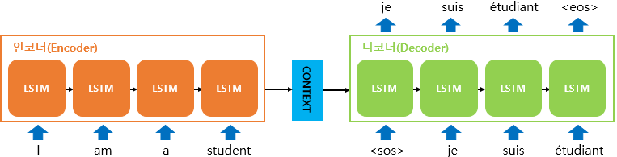

# 트랜스포머(Transformer)

구글이 2017년 발표한 논문 "Attention is all you need"에서 제시한 모델로 기존의 seq2seq 구조인 인코더-디코더 형태를 따르나 어텐션(Attention)만으로 구현한 모델이다.
이모델은 재귀 신경망을 사용하지 않고 **seq2seq의 단점**을 개선하면서 인코더-디코더 구조를 따른다. 

RNN의 순차적인 계산을 행렬곱을 사용하여 한번에 처리한다. 즉 한번의 연산으로 모든 중요 정보를을 임베딩할 수 있다. 

* RNN의 단점 

## 시퀀스-투-시퀀스(Sequence-to-Sequence)

seq2seq는 입력된 시퀀스로 부터 다음 도메인의 시퀀스를 출력하는 다양한 분야에서 사용되는 모델로 대표적인 예가 챗봇(Chatbot)과 기계 번역(Machine Translation)으로 챗봇은 입력 시퀀스와 출력 시퀀스를 각각 질문과 대답으로 구성하며 번역기는 입력 시퀀스와 출력 시퀀스를 각각 입력 문장과 번역 문장으로 만들게 된다. 이 이외에도 
내용 요약(Text Summarization), STT(Speech to Text)에도 사용될 수 있다.

seq2seq는 다음 그림과 같이 인코더와 디코더로 구성된다. 인코더와 디코더 구조는 재귀 신경망(RNN) 구조를 가진다. 실제 구현 시에는 성능 문제 때문에 LSTM 셀 또는 GRU 셀로 구성된다. 
인코더는 입력 문장의 모든 단어들을 순차적으로 입력 받은 후 마지막에 모든 단어 정보를 압축해서 하나의 벡터(컨텍스트 벡터: context vector)를 만든다. 
인코더는 컨텍스트 벡터를 디코더에 전송하고 디코더는 컨텍스트 벡터를 받아서 번역된 단어를 한 개씩 순차적으로 출력한다. 이 때 입력 문장과 출력 문장의 길이는 다를 수 있다.   

<출처: 딥러닝을 이용한 자연어 처리 입문(https://wikidocs.net/24996)>

 

<출처: 딥러닝을 이용한 자연어 처리 입문(https://wikidocs.net/24996)>

### seq2seq 단점

seq2seq 모들은 입력 시퀀스(문장)의 토큰을 차례로 입력하여 하나의 벡터로 
압축하기 때문에 처음에 입력된 토큰의 의미가 퇴색될 수 있고 문장이 수십 개에서 수백 개이 토큰으로 되어 있는 문장을 하나의 벡터로 표현하기 때문에 입력 시퀀스의 정보가 일부 손실된다는 단점을 가진다. 
 

## 참고 자료

* [딥러닝을 이용한 자연어 처리 입문 - 시퀀스-투-시퀀스(Sequence-to-Sequence)](https://wikidocs.net/24996)