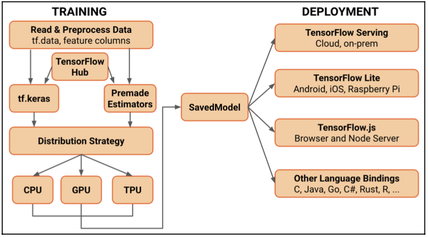

# 텐서플로우 2.0 기초 

## 요구사항 

* Python 3.4 이상
* 시스템: 우분투 16.04 이상 

## 특성 

* 간결성과 사용 용이
* **tf.keras**와 **즉시 실행(eager execution)**기능을 지원하여 모델 구축이 쉬어짐
* 모든 플랫폼에서 실행될 수 있는 모델 배포 
* 강력한 실험 기법과 연구를 위한 툴
* 직관적인 구성을 위한 단순한 API

* tf.keras
  - 텐서플로우를 쉽게 시작할 수 있도록 해주는 텐서플로우 2.0에서 중심이되는 고수준 API
  - 딥러닝 개념을 독립적으로 구현하는 도구
  - 즉각적인 반복 및 디버깅을 위한 즉시 실행과 같은 향상된 기능을 제공

* tf.data
  - 확장성 있는 입력 파이프라인을 구축하는 기능을 제공
  - 많은 양의 데이터를 데이터 메모리에 모두 저장할 필요 없이 디스크로부터 스트리밍할 수 있도록 함

## 텐서플로우 2.0의 새로운 구성 



* 간결성과 사용의 용이함에 기반하고 있음 
* 주요 업데이트 
	- tf.keras
	- **즉시 실행 (eager execution)**으로 쉬운 모델 구축
		+ 그래프를 그릴 필요 없이 연산을 즉시 실행하는 명령형 프로그래밍 환경
		+ 모든 연산은 사용자가 나중에 값을 계산할 수 있는 수학적인 그래프를 그리는 대신 실제적인 값을 반환
	- 텐서플로우 1.x 코드에서 존재했던 많은 상용 코드를 줄임
	- 모든 플랫폼에서 상업적으로 사용가능한 제품을 위한 모델 배포
	- 강력한 실험 기법과 연구를 위한 툴 
	- API 단순화 

* 인공지능 기술 활용 앱을 개발하는 경우 앞의 다이어그램과 같이 학습(training)과 배포(deployment) 작업이 요구 
	- 텐서플로우는 두 작업을 위한 파이썬 API를 제공
		+ Julia, JavaScript, R과 같은 다른 언어로도 수행 가능
	- 학습 단계: 데이터 파이프라인, 모델 제작, 학습, 그리고 분산 처리 방법들이 포함
	- 모델 배포 단계: TF Serving, TF Lite, TF.js와 같은 다양한 배포 방법과 다른 언어에 대한 바인딩 방법을 포함

## 워크플로우

* 학습 데이터 준비
* tf.keras 또는 미리 적성된 추정기(estiator)를 이용하여 모델을 구축, 학습, 검증
* 즉시 실행 기능을 활용하여 모델을 실행하고 디버그하는 단계를 진행 
* 모델을 배포할 준비가 되면, SavedModel 모듈로 모델을 보내 다이어그램에서 보여주는 다양한 방법으로 모델을 배포

* 즉시 실행(eager execution)
 - 그래프들을 그릴 필요 없이 연산을 즉시 실행하는 프로그래밍 환경
 - 모든 연산은 사용자가 나중에 값을 계산할 수 있는 수학적인 그래프를 그리는 대신 실제적인 값을 반환
 - 표준 파이썬 코드 흐름을 따르는 직곽적인 인터페이스를 제공
 
## 텐서플로우 2.0 사용하기

* 저수준 API와 고수준 API를 이용하는 두 가지 방법 사용이 가능하다.
* 저수준 API를 이용하기 위해서 tf.GradientTape와 tf.function 같은 API 들이 구현됨

## 텐서플로우 2.0과 텐서플로우 1.x 비교 

* TF 1.x에서 ```sess.run``` 으로 실행되던 텐서는 함수가 됨.
* feed dict와 placeholder 들이 함수의 인자
* 모든 API들과 모듈들이 호출 가능한 객체인 완전한 객체지향 코드로 전환이 이루어 짐 

## tf.keras

tf.keras는 모델 생성을 위해 다음 3개의 메소드를 제공한다.

* 순차형(Sequential) API: TF 2.0 에서 변경된 점

	- TF 1.x에서 모델 생성을 위해 사용한 ```tf.layers``` 모듈이 ```tf.keras.layers```로 변경됨.
 	- ```tf.layers```의 많은 메소드가 ```tf.keras.layers```로 복제됨.
 	- 순차형 API를 사용하여 모델을 생성하는 것은 심볼릭 ```tf.keras``` 레이어 클래스를 사용하여 **선형 모델을 만드는 것**으로 완료

 ```python
 	model = tf.keras.Sequential([
 		tf.keras.layers.Conv2D(32,2, activation = 'relu',kernel_regularizer = tf.keras.kernel_regularizer.l2(0.04), input_shape=(28, 28, 1)),
 		tf.keras.layers.MaxPooling2D(),
 		tf.keras.layers.Flatten(),
 		tf.keras.layers.Dropout(0.1),
 		tf.keras.layers.Dense(64, activation='relu'),
 		tf.keras.layers.BatchNormalization(),
 		tf.keras.layers.Dense(20, activation='softmax')
 		])
 
 	train_data = tf.ones(shape=(1, 28, 28, 1))
 	test_data = tf.ones(shape=(1, 28, 28, 1))

 	train_out = model(train_data, training=True)

 	test_out = model(test_data, training=False)
 ``` 
* 함수형(Functional) API

 	- 이전 레이어의 출력 텐서에서 레이어 클래스들을 호출하는 것을 기반하기 때문에 **순차형 API보다 더 유연성이 높다**. 
 	- Inception 및 ResNet 아키텍처와 같은 **비선형 모델 및 아키텍처를 구현**할 수 있다.

```python
 	encoder_input = keras.Input(shape=(28, 28, 1), name='img')
 	x = layers.Conv2D(16, 3, activation='relu')(encoder_input)
 	x = layers.Conv2D(32, 3, activation='relu')(x)
 	x = layers.MaxPooling2D(3)(x)
 	x = layers.Conv2D(32, 3, activation='relu')(x)
 	x = layers.Conv2D(16, 3, activation='relu')(x)
 	encoder_output = layers.GlobalMaxPooling2D()(x)

 	encoder = keras.Model(encoder_input, encoder_output, name='encoder')
 ``` 

* 모델 서브클래싱(subclassing) 기술

	- 텐서플로우에 포함되지 않은 기술과 기법으로 구현된 커스텀 모델과 레이어를 만드는데 이용한다는 점에서 저수준의 접근 방식과 매우 유사
	- ```tf.keras.Model``` 기반 클래스로 부터 상속되는 클래스를 생성하는 것과 관련됨
	- 입력 인수와 학습 인수를 취하도록 호출 메소드를 정의한 다음 모델로 부터 전방향 패스의 결과를 계산하고 반환

```python
class ResNet(tf.keras.Model):
		def __init__(self):
			super(ResNet, self).__init__()
			self.block_1 = ResNetBlock()
			self.block_2 = ResNetBlock()
			self.global_pool = layers.GlobalAveragePooling2d()
			self.classifier = Dese(num_classes)

		def call(self, inputs):
			x = self.block_1(inputs)
			x = self.block_2(x)
			x = self.global_pool(x)
			return self.classifier(x)

	resnet = ResNet()
	dataset =...
	resnet.fit(dataset, epochs=10)
```

## 풍부한 확장기능 

### Ragged Tensor

* 가변 크기 데이터는 머신 러닝을 모델을 학습하고 제공할 때 흔히 발생
	- 가장 큰 크기의 레코드를 사용하고 크기가 작은 데이터는 패딩을 사용하여 해결
	- 메모리와 저장장치 뿐만 아니라 손환 모델의 입력을 다루는 연산에도 비효율적

* Ragged Tensor 
	- 가변 링크드 리스토와 유사, 가변성이 중첩된 차원(dimension)에서도 발생


* Ragged Tensor를 사용할 수 있는 일반적인 비정형 데이터
	- 가변 길이 특성: 예 - 단어의 문자 수
	- 가변 길이로 된 순차 입력들의 배치: 예 - 문장, 시계열 데이터 및 오디오 클립 
	- 계층화된 입력: 예 - 섹션, 단락, 문장, 단어 및 문자로 세분화된 텍스트 문서; 조직 계층
	- 구조화된 입력의 개별 필드: 예 - HTTP 요청 페이로드, 프로토콜 버퍼 및 JSON 데이터 

* Ragged Tensor
	- Ragged Tensor는 길이가 일정하지 않은 하나 또는 그 이상의 Ragged 차원을 가지는 Tensor
	- 가변 길이의 슬라이스(slice)를 가지는 차원
	- 제일 바깥쪽 차원은 정형: 해당 차원의 모든 슬라이스는 동일한 길이를 가짐

	- 모양은 현재 아래의 형태로 제한 

		+ 단일 정형 차수
		+ 하나 또는 그 이상 이어지는 ragged 차수
		+ 제로 또는 그 이상 이어지는 정형 차수 

* Ragged Tensor의 구성하는 방법 

	- (방법 1) tf.ragged.constand() 를 사용하는 것 

```python
	sentences = tf.ragged.constant([
						["Hello", "World", "!"]
						["We", "are", "testing", "tf.ragged constant", "."]
				])
	print(sentences)
```

패딩된 요소를 가지는 파이썬 리스트나 이전 형식의 텐서로 부터 Ragged Tensor를 생성할 수 있다. 이전 버전의 Tensorflow로 작성된 하위 단계의 파이프라인 데이터를 사용하여 TF 2.0 모델을 구축할 때 유용하다. 이는 ``tf.RaggedTensor.from_tensor()``함수에 의해 가능하다.

```python
x = [[1, 7, 0, 0, 0],
	 [2, 0, 0, 0, 0],
	 [4, 5, 8, 9, 1],
	 [1, 0, 0, 0, 0]
    ]

print(tf.RaggedTensor.from_tensor(x, padding=0))
```

* Ragged Tensor의 기본 연산 (더하기) 

```python
x = tf.ragged.constant([
                       [1, 2, 3, 4],
                       [1, 2]
                      ])

y = tf.ragged.constant([
                       [4, 3, 2, 1],
                       [5, 6]
])
print(tf.add(x, y))
```

* Ragged Tensor의 곱셈 

```python
x = tf.ragged.constant([
                        [1, 2, 3, 4],
                        [1, 2]
])

print(x * 2)
print(x * x)
```

[Code](https://colab.research.google.com/drive/1uGoCXqVSCxlhEr2DRm4jhccn5plt1kqO?usp=sharing)

* Tensorflow Addon(TF Addons) 
  - 최신의 레이어, 손실 함수, 초기화기, 최적화기 같은 것 들이 TF 2.0 오브젝트의 형태로 포함
  - TF Addons에서 가져온 API들을 추가 변경없이 일반적인 ``tf.keras`` 모델로 완벽하게 통합할 수 있음


* Tensorflow Text: 
  - TF2.0에 NLP API가 추가된 최신의 모듈
  - NLP 분야에서 널리 사용되는 기술 중 문장 및 단어의 토큰화와 같은 메소드가 포함

* Tensorflow Probability
  - Tensorflow에서 확률 계산을 위한 API

## Reference

* A. Baranwal, A. Khatri, T. Baranwal, "새롭게 배우는 텐서플로우 2.0"


